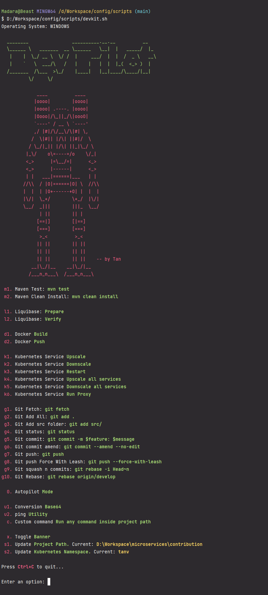

E:\Workspace\ms\purchaseoption
# Dev Pilot 4
Shell commands used for Day to day Software Development. 
The ultimate goal is to automate complete development lifecycle of software development with as much automation as possible

This Project is part of **[CLUI](https://github.com/tanvoid0/clui) Project**, which is a Cross Platform CLI App with User Interface.
While developing the project, felt the urge to learn advanced **Shell based commands** to fulfill the goal of the project.
So, this is a draft (but not limited to) and lightweight cli version.

Currently, support limited to **spring boot and npm** projects only.

### Features
* Maven
* NPM
* Liquibase
* Docker
* Kubernetes
* Git
* Base64
* ping
* Custom Command
* Cache data (Save Common data e.g., namespace)

### On Test
* Autopilot

### Upcoming features
* systempropertiesadvanced (to open env variable in one tap)
* switch between projects

## Commands (not fully updated)
## Maven Commands
### m1
**Action:** Runs Spring boot tests

**Command** 

`mvn test`

### m2
**Action:** Clean install maven project

**Command** 

`mvn clean install`

### l1
**Action** Prepares liquibase 

**Command**

`mvn -PLIQUIBASE_PREPARE_FOR_DIFF test`

`mvn liquibase:update liquibase:diff`

**Post Action**

Copies liquibase from `target/liquibase-diff-changelog.yml` to `src/main/resources/db/changelog/new_filename.yml` with inline `new_filename` provided.
Then replaces types with custom types *(e.g., date to "${type.date}" )*.

### l2
**Action** Validates liquibase file changes

**Command**

`mvn -PLIQUIBASE_VERIFY test`

### d1
**Action** Builds docker image for project

**Command** 

`docker build --network=host --tag eu.gcr.io/olm-rd/efm/${1}:${2} .`

**Variables**
- **$1 :** Name of the project *(Derived from the root folder name of the project path that is initialized at the start of the script initialization)*
- **$2 :** Name of user's namespace *(Initialized at the start)*

### k1
**Action** Upscale kubernetes service of the current project

**Command**

`kubectl scale -n "${2}" deployment "${1}"-ms-deployment --replicas=1`

**Variables**
- **$1 :** Project name
- **$2 :** Namespace

### k2
**Action** Downscale kubernetes service of the current project

**Command**

`kubectl scale -n "${2}" deployment "${1}"-ms-deployment --replicas=0`

**Variables**
- **$1 :** Project name
- **$2 :** Namespace

### k3
**Action** Restart kubernetes service of the current project

**Command**

`kubectl scale -n "${2}" deployment "${1}"-ms-deployment --replicas=0`

`sleep 30s`

`kubectl scale -n "${2}" deployment "${1}"-ms-deployment --replicas=1`

**Variables**
- **$1 :** Project name
- **$2 :** Namespace

### x
**Action** Toggle Logo

### s1
**Action** Update Project path

### s2
**Action** Update Namespace

## Future Plans

* Based on **BUILD SUCCESS / BUILD FAILURE** from command response, continue next action and automate complete cycle if possible.
* NodeJS Project
  * Unit Testing
  * Build
  * Automation